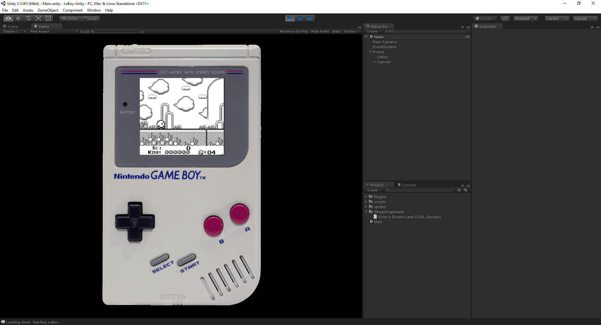

# LeBoy - Unity frontend

A quick and experimental Unity frontend for [mrhelmut's LeBoy GB emulator](https://github.com/mrhelmut/LeBoy).

## Versions

- Unity 2021.1.12f1

## Attribution

**Disclaimers:**

- GAME BOY is a trademark of Nintendo Co., Ltd.
- **This is just the frontend. All the emulator work is from [mrhelmut](https://github.com/mrhelmut/LeBoy).**

## Usage

**This is a recreational project and it shouldn't be used in production or in a commercial setup.**

1. Place a ROM in `StreamingAssets`
2. Update the `LeBoyScript.romName` field and fill it with the ROM you want to load (set the full file name, like "Mario.gb")
3. Launch
4. Enjoy!

## Know issues

- Clock is too fast in builds
- And everything related to LeBoy, obviously
